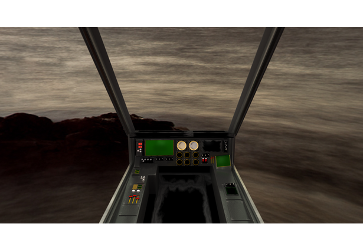

 

Click for video: 
 
A virtual cockpit for the AR Drone using Oculus head tracking and Leap Motion

Built at Hacking Generation Y with Logan Taylor, Matthew Linker, and Andrew Liu
http://challengepost.com/software/flyby-vr-drone

FlyBy is a virtual reality application that integrates Oculus Rift and Leap Motion with an AR.Drone to create a virtual cockpit for a user to operate the drone. Gone is the need for remote controllers and unintuitive buttons, as FlyBy allows the user to control the AR.Drone with natural movements of the head and hands. FlyBy makes operating AR.Drones easier and more fun for everyone, as it provides a completely intuitive control method—the learning curve is virtually nonexistent. When using FlyBy, the user truly feels like he or she is in the cockpit of our built-from-scratch virtual Apache helicopter. Using Oculus’s VR capabilities, they see an extraordinarily detailed cockpit as well as a live video feed streamed from the onboard camera. In addition, to further enhance the user’s piloting experience, FlyBy incorporates Leap Motion and an Android app to track simple hand gestures to control the drone's altitude. Overall, Flyby is an elegant and intuitive control system for AR.Drones which will greatly enhance their ease of use and enjoyment.

#How does it work?
Uses a Node.js server with node-ar-drone to control the drone. This server then communicates with Unity3d game engine over sockets. Within the Unity3d game engine we use LeapMotionVR assets and a built-from-scratch 3d cockpit to create a immersive 3d experience. Using Oculus head tracking and accelerometer data from FlyBy-VR-Drone-Android, commands are relayed to the Node.js server.
